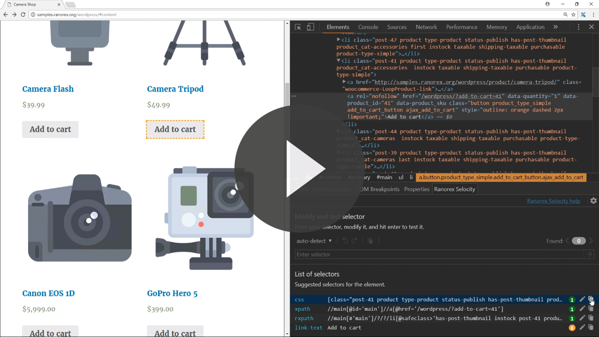

# Ranorex Selocity - Free Chrome Extension

Auto-generate robust and reliable CSS, XPath and RanoreXPath selectors in your Chrome DevTools.

 

## What's in this repo?

Use this repository to drop your feedback, feature requests, or issues you may have found when using our Chrome browser extension. We'd love to know what you think of it!

## How do I get the Ranorex Selocity Chrome Extension?

You can install the extension in the [Google Chrome Web Store](https://chrome.google.com/webstore/detail/ranorex-selocity/ocgghcnnjekfpbmafindjmijdpopafoe).

## Where can I get more information?

Visit [https://www.ranorex.com/selocity](https://www.ranorex.com/selocity) to learn about the features and benefits of Ranorex Selocity, and review our updates in the [changelog](CHANGELOG.md).
